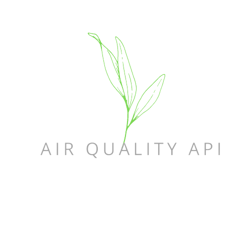

# 🍃 Air Quality API

<p align="center">
    
    <p align="center">
        <a href="https://github.com/mihaichris/air-quality/actions"></a>
        <a href="https://app.codecov.io/gh/mihaichris/air-quality"></a>
        <a href="https://github.com/mihaichris/air-quality/issues"></a>
    </p>
</p>


# Description
Air-quality allows you to retrieve the values for different pollutants and pollen from a region based on specific coordinates 🍃. The library is powered by [OpenMeteo](https://open-meteo.com/en/docs/air-quality-api) air quality API. 

# 🚀 Installation

```php
$ composer require mihaichris/air-quality
```

# Basic Usage

```php
use Air\Quality\AirQuality;

//Getting the air quality from Bucharest.
$airQuality = new AirQuality(44.43, 26.11);

//Get the air quality now.
$airQuality->getNow();

//Get the air quality in the past days.
$airQuality->getPast(2);

//Get the air quality between specific dates.
$airQuality->getBetweenDates('2023-01-01', '2023-02-01');

```

# 👨‍💻 Author
Mihai-Cristian Făgădău
 * Github: [@mihaichris](https://github.com/mihaichris)
 * LinkedIn: [in/mihai-fagadau](https://www.linkedin.com/in/mihai-fagadau/)
 * Website: [mihaifagadau.dev](https://mihaifagadau.dev)

# 🤝 Contributing
Contributing details can be found at [here](./CONTRIBUTING.md).

# 📝 License
This project is [MIT](https://opensource.org/licenses/MIT) licensed.
